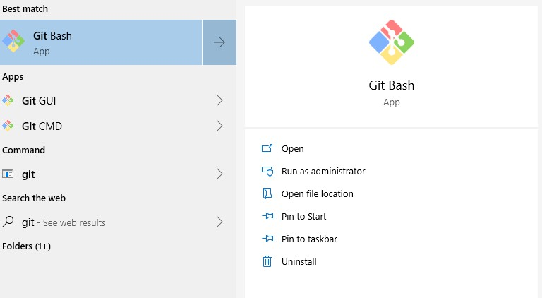

## 
DEVELOPER ENVIRONMENT SETUP DOCUMENTATION

### Task 1 - OS Installation
I already has windows 10 pro version 1903 setup for my local machine since my device does not support windows 11 as shown in the image below.

### Task 2 - IDE Setup
I also had already installed and setup my VS Code since I do other development work hence this task wasn't required.

### Task 3 - Version Control setup

As mentioned before, I have done some development work and git and git bash have been my favourite tools for version control and hence I had these tools already setup and configured.Here are couple of images showcasing my setup

<table>
  <tr>
    <td></td>
    <td></td>
  </tr>
</table>